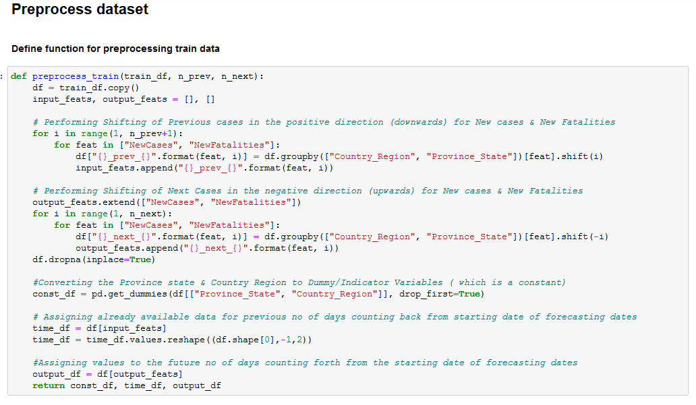
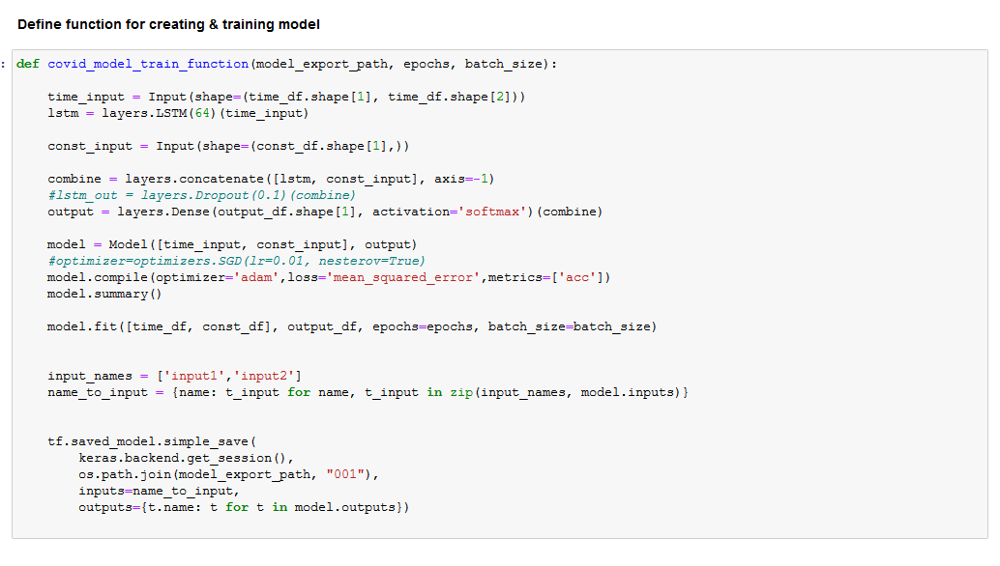
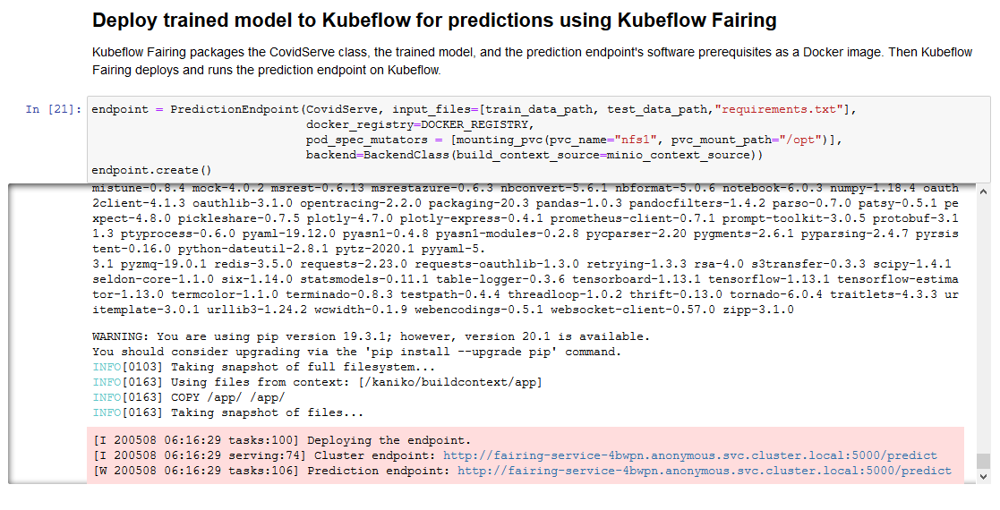
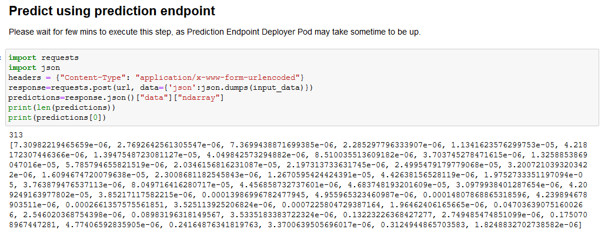

# COVID-19 Forecasting using Kubeflow Fairing 

## What we're going to build

Train & Save a COVID forecast model using Kubeflow Fairing from Jupyter Notebook. Then, deploy the trained model to Kubeflow using Kubeflow Fairing for Predictions.


## Infrastructure used

* Cisco UCS - C240


## Setup


### Install NFS server (if not installed)

To install NFS server follow [steps](./../notebook#install-nfs-server-if-not-installed)

### Create Jupyter notebook server

Follow the [steps](./../notebook#create--connect-to-jupyter-notebook-server) to create & connect to Jupyter Notebook Server in Kubeflow.

### Upload COVID Forecast Fairing notebook

Upload the [COVID-Forecast-fairing notebook](./COVID-Forecast-fairing.ipynb) into Jupyter Notebook server in Kubeflow.


### Run COVID notebook

Open & run the uploaded COVID-Forecast-fairing.ipynb file.


### Clone Cisco Kubeflow starter pack repository


### Configure Docker Registry credentials 


### Create requirements.txt with required python packages


### Import required libraries


### Get minio-service cluster IP to upload Docker build context

Note: Please change DOCKER_REGISTRY to the registry for which you've configured credentials. Minio is used as the build context source here.


### Create config-map to map your own docker credentials from created config.json

Note: create configmap named "docker-config". If already exists, delete existing one and create new configmap.

* Delete existing configmap

```
kubectl delete configmap -n $namespace docker-config
```


### Define paths for train & test data files


### Add pre-processing function for train data



### Add pre-processing function for test data


### Add main pre-processing function


### Add function for training Model




### Define COVID class to be used by Kubeflow Fairing

Note: Must necessarily contain train() and predict() methods


### Train COVID model using Kubeflow Fairing

Kubeflow Fairing packages the CovidServe class, the training data, and requirements.txt as a Docker image. 
It then builds & runs the training job on Kubeflow.


### Deploy trained model to Kubeflow for predictions using Kubeflow Fairing




### Get prediction endpoint


### Predict for input data using prediction endpoint



### Perform post-processing of prediction result


### Visualise the final prediction results


### View visualised results as graph


### Delete prediction endpoint


