# COVID-19 Forecasting using Kubeflow Fairing 

## What we're going to build

Train & Save a COVID forecast model using Kubeflow Fairing from Jupyter Notebook. Then, deploy the trained model to Kubeflow using Kubeflow Fairing for Predictions.


## Infrastructure used

* Cisco UCS - C240


## Setup


### Create Jupyter notebook server

Follow the [steps](./../notebook#create--connect-to-jupyter-notebook-server) to create & connect to Jupyter Notebook Server in Kubeflow.

### Upload COVID forecast Fairing notebook

Upload the [COVID-Forecast-fairing notebook](./COVID-Forecast-fairing.ipynb) into Jupyter Notebook server in Kubeflow.

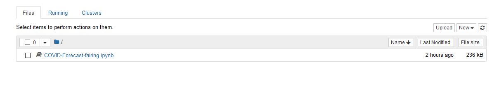


### Run COVID notebook

Open & run the uploaded COVID-Forecast-fairing.ipynb file.


### Clone Cisco Kubeflow starter pack repository

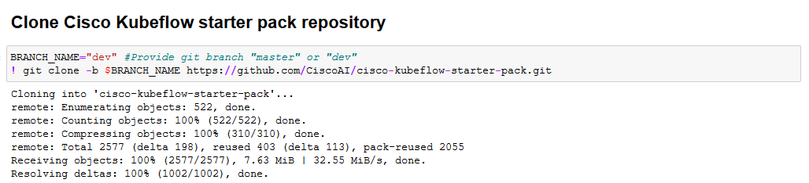


### Configure Docker Registry credentials 

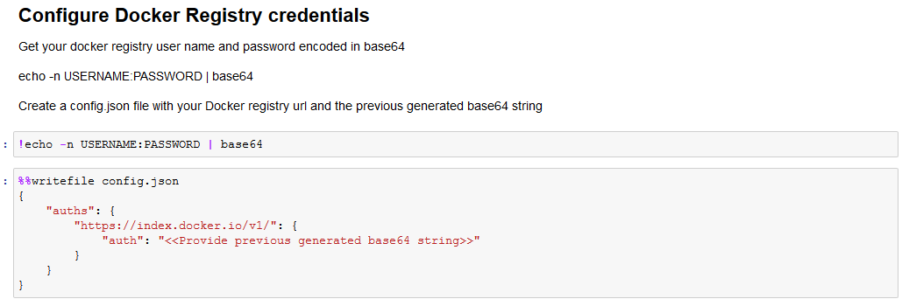

### Create requirements.txt with required python packages

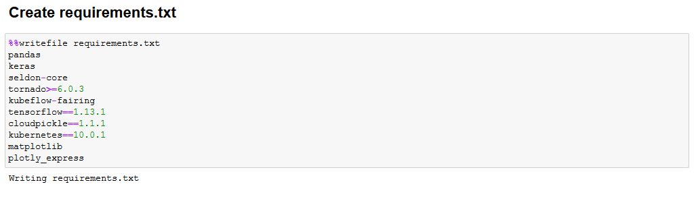

### Import required libraries

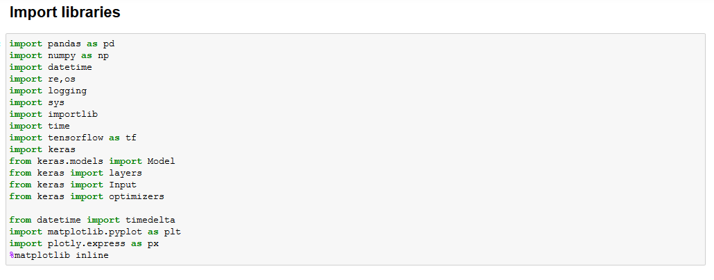

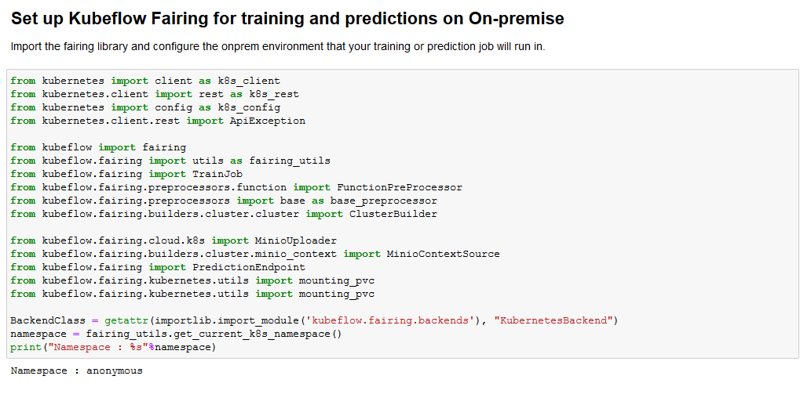

### Get minio-service cluster IP to upload Docker build context


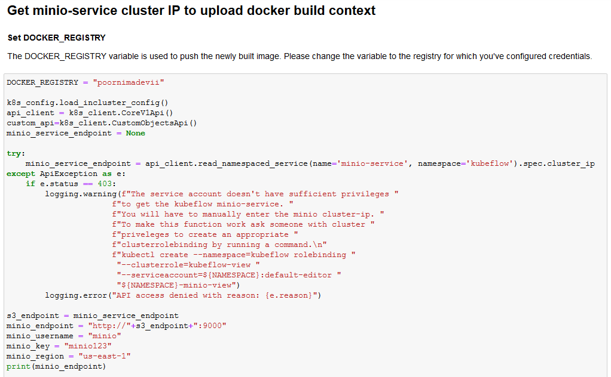

### Create config-map to map your own docker credentials from created config.json

Note: create configmap named "docker-config". If already exists, delete existing one and create new configmap.

* Delete existing configmap

```
kubectl delete configmap -n $namespace docker-config
```

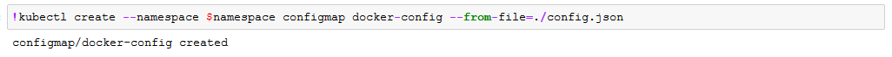

### Define paths for train & test data files


### Build docker image for the model
Note: Upload dataset, Dockerfile, and covid-model.py into notebook.
Builder builds training image using input files, an output_map - a map from source location to the location inside the context, and pushes it to the registry.

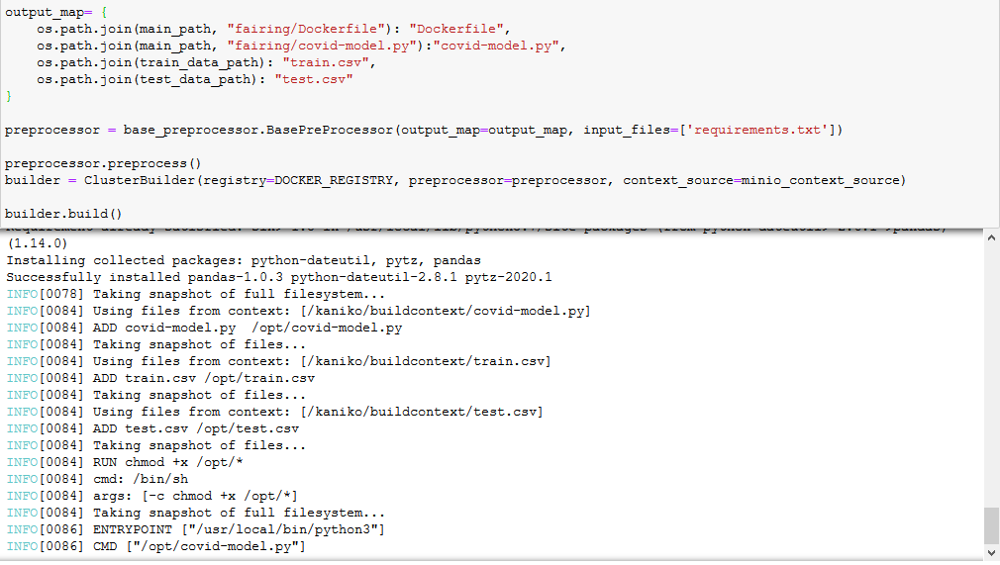


### Create Katib experiment
Use Katib for automated tuning of your machine learning (ML) model’s hyperparameters and architecture.

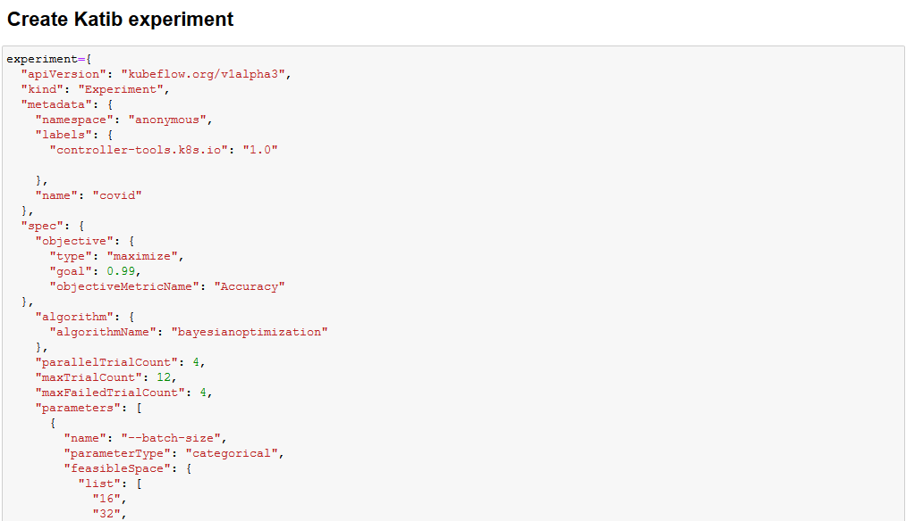

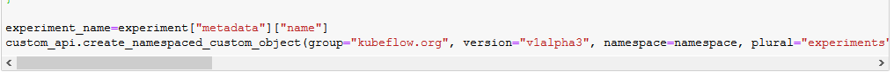

### Wait for Katib experiment succeeded status

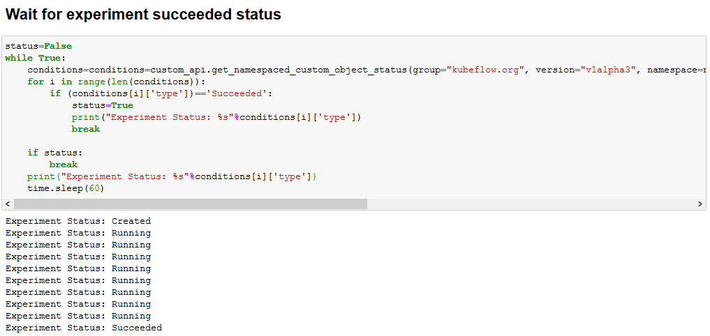

### View the results of the experiment in the Katib UI

[Click here](Katib.md) to view the sample result of Katib experiment.

### Get optimal hyperparameters

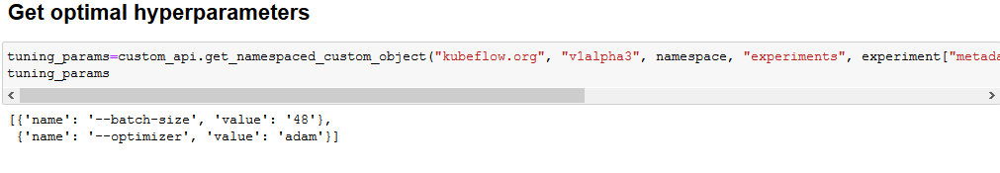


### Add pre-processing function for train data


### Add pre-processing function for test data

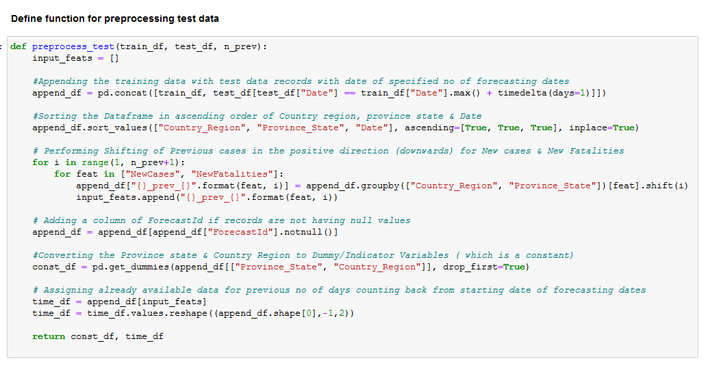


### Add main pre-processing function

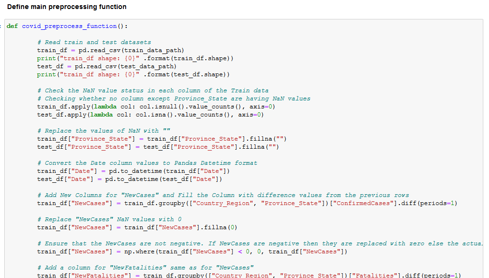


### Add function for training Model


### Define COVID class to be used by Kubeflow Fairing

Note: Must necessarily contain train() and predict() methods


### Train COVID model using Kubeflow Fairing

Kubeflow Fairing packages the CovidServe class, the training data, and requirements.txt as a Docker image. 
It then builds & runs the training job on Kubeflow.


### Deploy trained model to Kubeflow for predictions using Kubeflow Fairing


### Get prediction endpoint


### Predict for input data using prediction endpoint


### Perform post-processing of prediction result

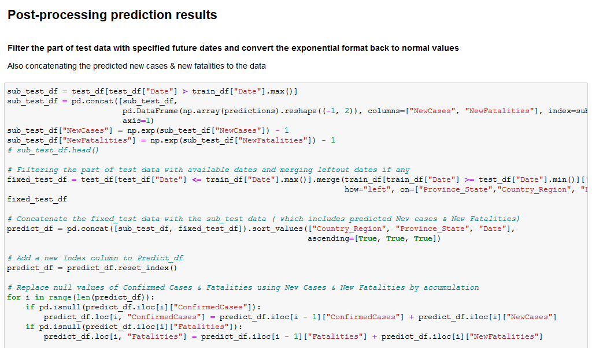

### Visualise the final prediction results

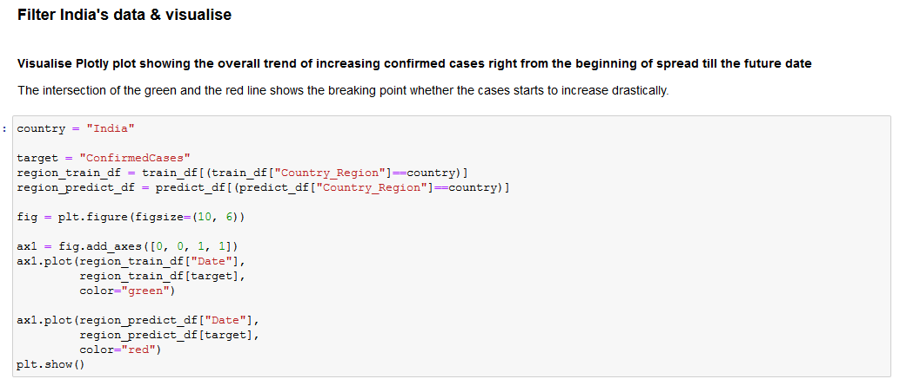

### View visualised results as graph


### Delete prediction endpoint

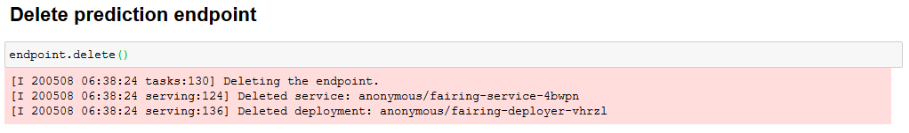


