# COVID-19 Forecasting using Kubeflow Fairing 

## What we're going to build

Train & Save a COVID model using Kubeflow Fairing from Jupyter Notebook. Then, deploy the trained model to Kubeflow for Predictions.


## Infrastructure Used

* Cisco UCS - C240


## Setup


### Install NFS server (if not installed)

To install NFS server follow [steps](./../notebook#install-nfs-server-if-not-installed)

### Create Jupyter Notebook Server

Follow the [steps](./../notebook#create--connect-to-jupyter-notebook-server) to create & connect to Jupyter Notebook Server in Kubeflow

### Upload Notebook, Input Data files

Upload [COVID-Forecast-fairing.ipynb](COVID-Forecast-fairing.ipynb), [train.csv](../data/train.csv) & [test.csv](../data/test.csv) to notebook server.

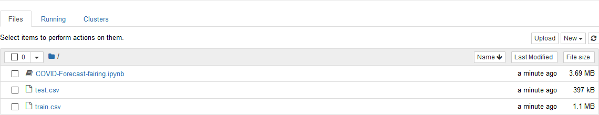

### Run COVID Notebook

Open the COVID-Forecast-fairing.ipynb file and run notebook. Requirements.txt and docker configuration file (config.json) will be added automatically.

### Configure Docker Registry credentials 

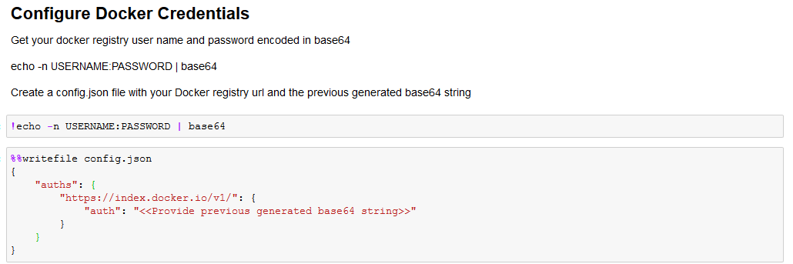

### Create requirements.txt with require python packages

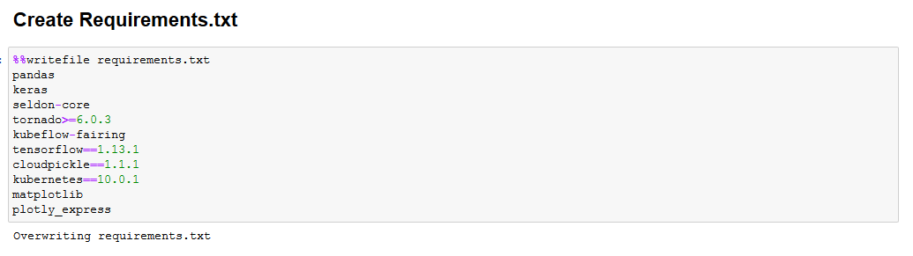

### Import Required Libraries

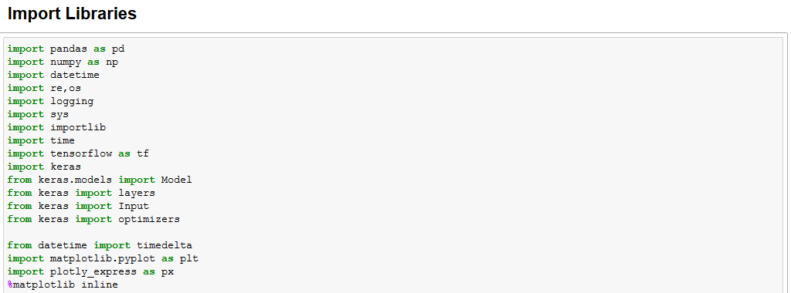


### Get minio-service cluster IP to upload docker build context

Note: Please change DOCKER_REGISTRY to the registry for which you've configured credentials. Minio is used as the build context source here.


### Create config-map to map your own docker credentials from created config.json

Note: create configmap named "docker-config". If already exists, delete existing one and create new configmap.

* Delete existing configmap

```
kubectl delete configmap -n $namespace docker-config
```


### Add Preprocessing Function for train data

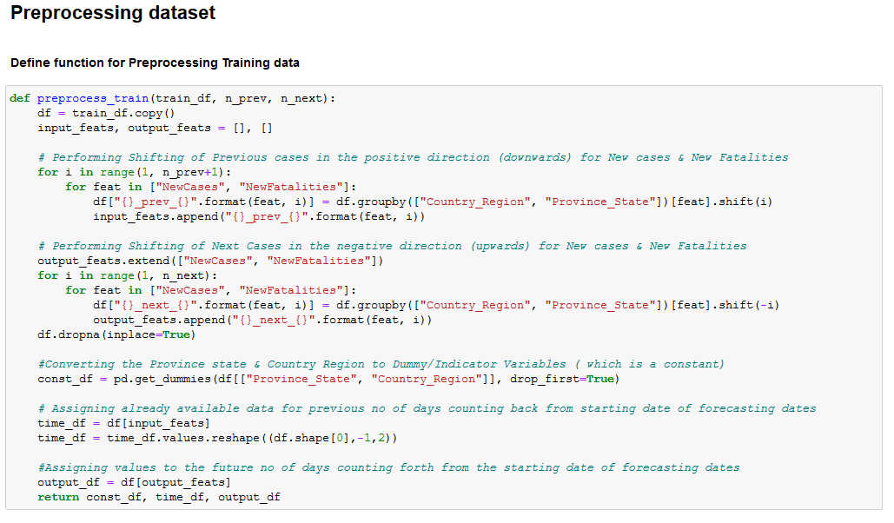

### Add Preprocessing Function for test data

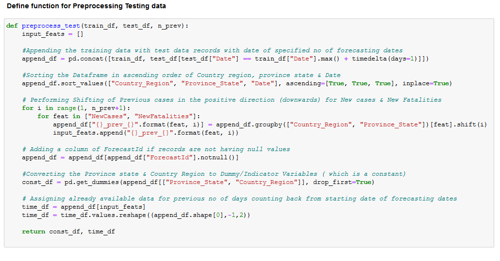


### Add Central Preprocessing Function

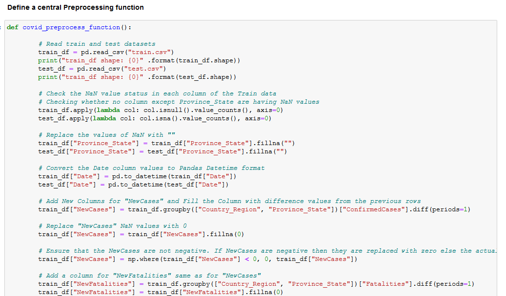


### Add Function for Training Model

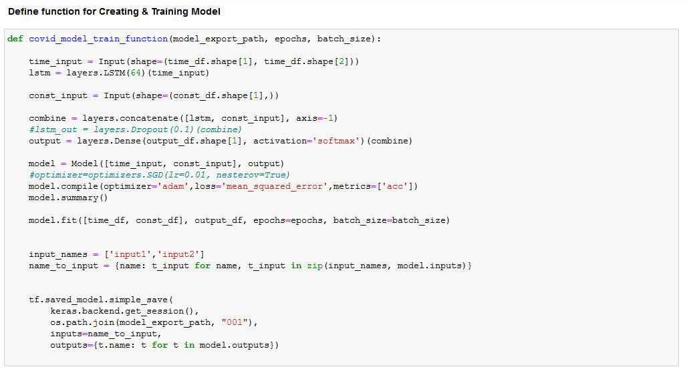


### Define COVID class to be used by Kubeflow fairing

Note: Must necessarily contain train() and predict() methods


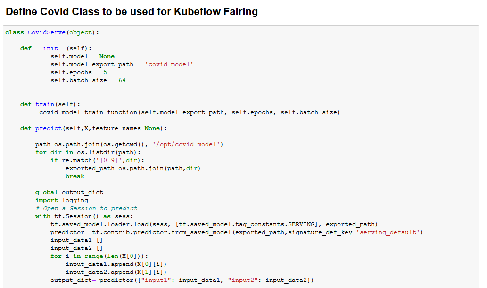


### Train COVID model on Kubeflow

Kubeflow Fairing packages the CovidServe class, the training data, and requirements.txt as a Docker image. 
It then builds & runs the training job on Kubeflow.

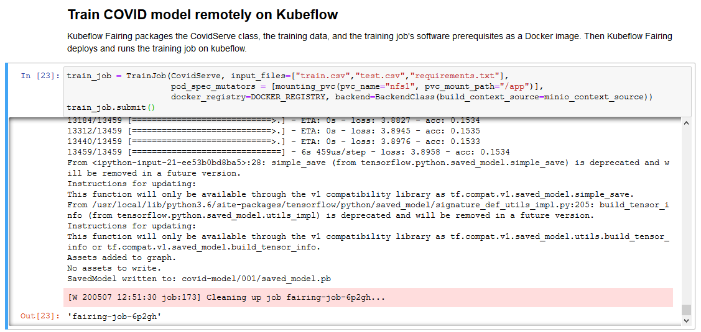

### Deploy the trained model to Kubeflow for predictions

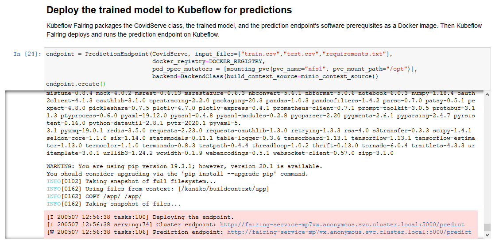


### Get prediction endpoint

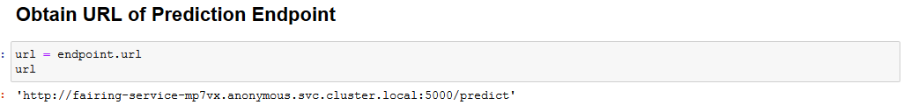

### Predict location for data using prediction endpoint

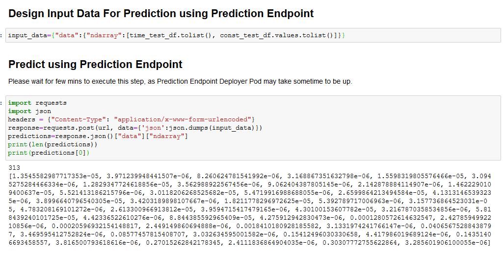

### Perform Post Processing of Prediction Result

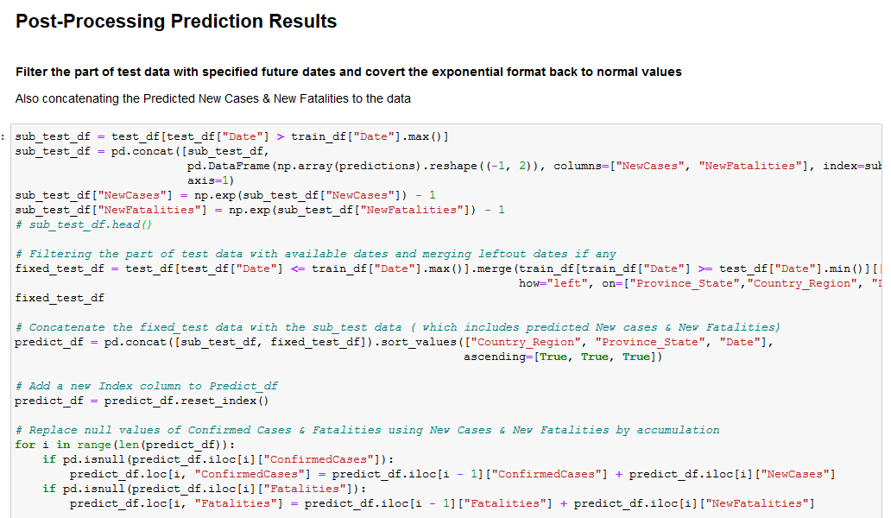

### Visualise the Final Prediction Results

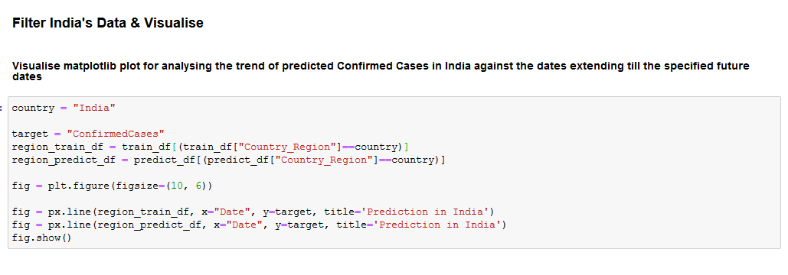

### View Visualised Results as Graph

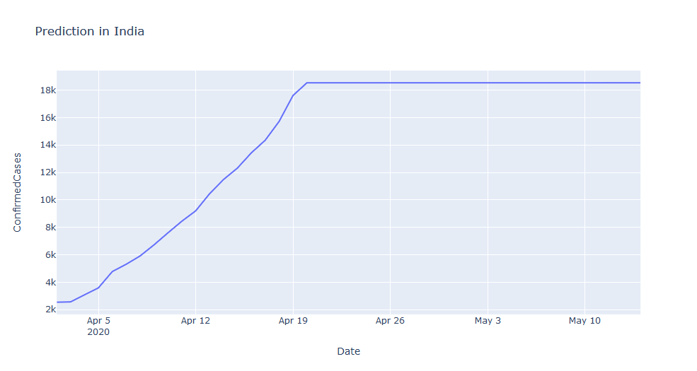

