# COVID-19 Forecasting 

## What we're going to do

Train & save a COVID model from kubeflow jupyter notebook.
Then, serve and predict using the saved model.

### Infrastructure Used

* Cisco UCS - C240M5 and C480ML

## Setup

### Retrieve Ingress IP

We need to know the external IP of the 'istio-ingressgateway' service. This can be retrieved by the following steps.

```
kubectl get service -n istio-system istio-ingressgateway
```

If your service is of LoadBalancer Type, use the 'EXTERNAL-IP' of this service.

Or else, if your service is of NodePort Type - run the following command:

```
kubectl get nodes -o wide
```

Use either of 'EXTERNAL-IP' or 'INTERNAL-IP' of any of the nodes based on which IP is accessible in your network.

This IP will be referred to as INGRESS_IP from here on.

### Create & Connect to Jupyter Notebook Server

You can access Kubeflow Dashboard using the Ingress IP and _31380_ port. For example, http://<INGRESS_IP:31380>

Select _anonymous_ namespace and click Notebook Servers in the left panel of the Kubeflow Dashboard


Click New Server button and provide required details 

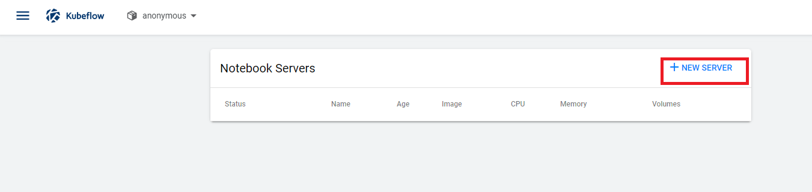

Provide Notebook Server name and select notebook image appropriately as below
     
     CPU  - gcr.io/kubeflow-images-public/tensorflow-1.15.2-notebook-cpu:1.0.0
     GPU  - gcr.io/kubeflow-images-public/tensorflow-1.15.2-notebook-gpu:1.0.0


Create new Workspace Volume


If you are creating GPU attached notebook then choose number of GPUs and GPU Vendor as *NVIDIA*. 

Click Launch Button


Once Notebook Server is created, click on Connect button.

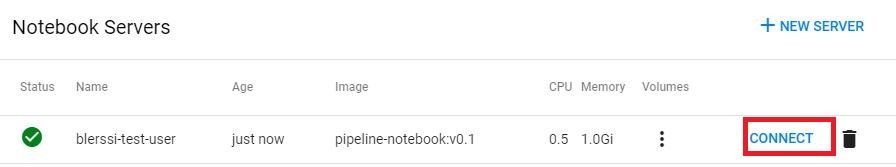

### Upload covid-forecast.ipynb file

Upload the [covid-forecast.ipynb](./covid-forecast.ipynb) to the Notebook Server.

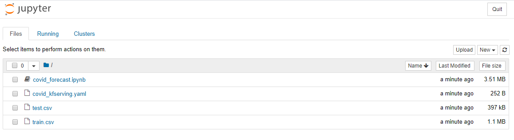

### Preprocessing  dataset

Open the notebook file and Pre-process dataset

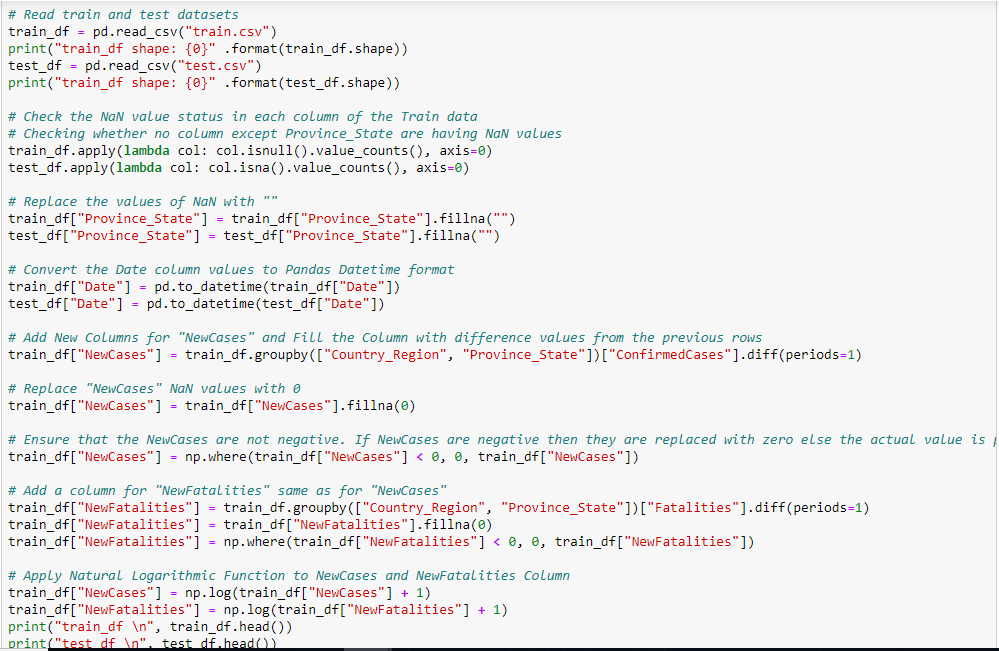

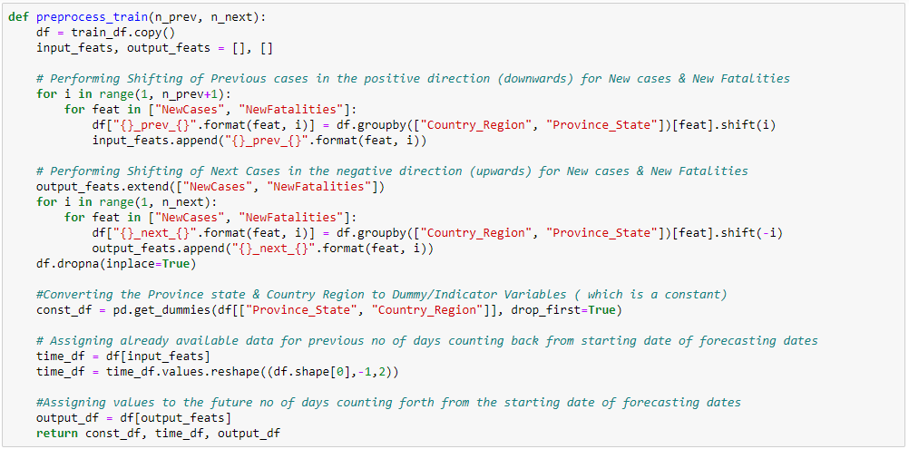

### Create the model
Create and compile the Keras model

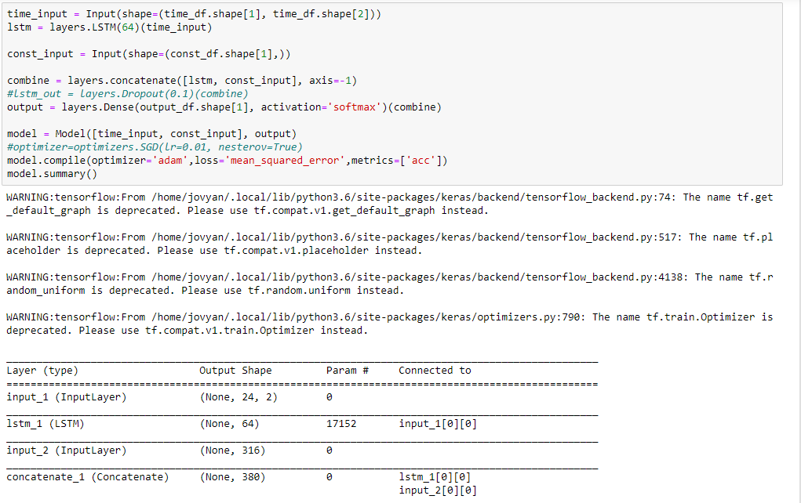

### Train and evaluate
Now, train the model in the usual way, calling fit on the model and passing the preprocessed data

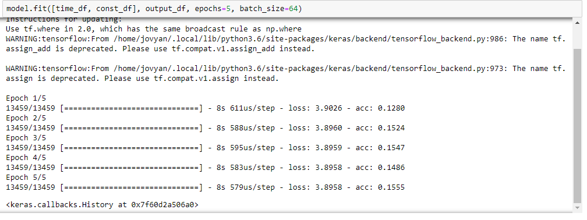

### Save the model
Save the keras model in tensorflow format

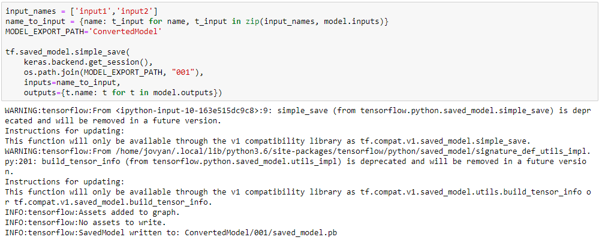

### Serve COVID Model from K8s PVC through Kfserving

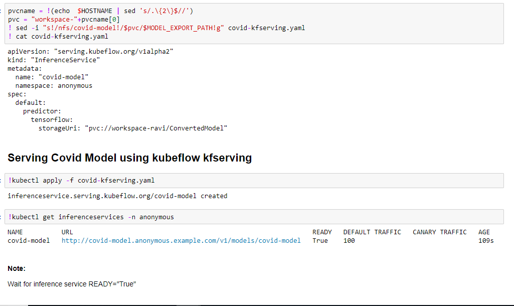

### Predict data using served COVID Model 
Change Ingress IP in the requests post call to your provided value before executing prediction.

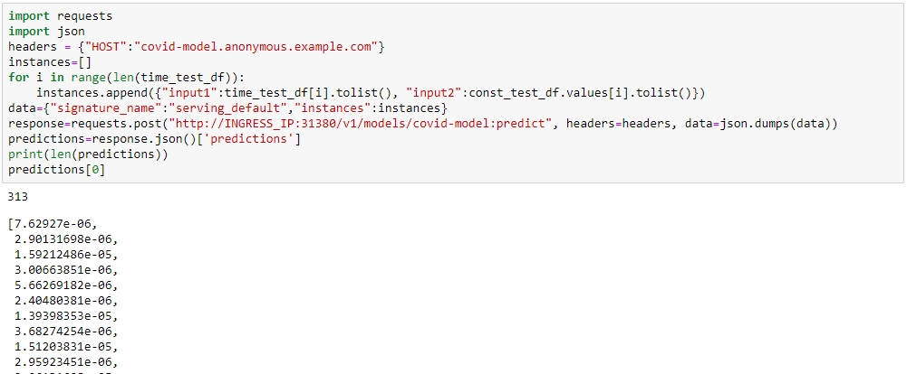

Get the Prediction result of Confirmed Cases & Fatalities for the specified future dates

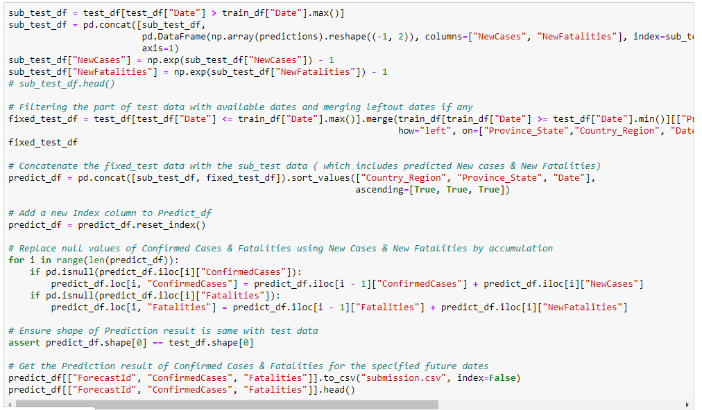

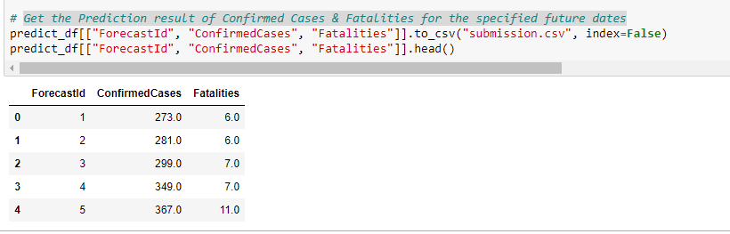

### Filter India's Data & Visualise

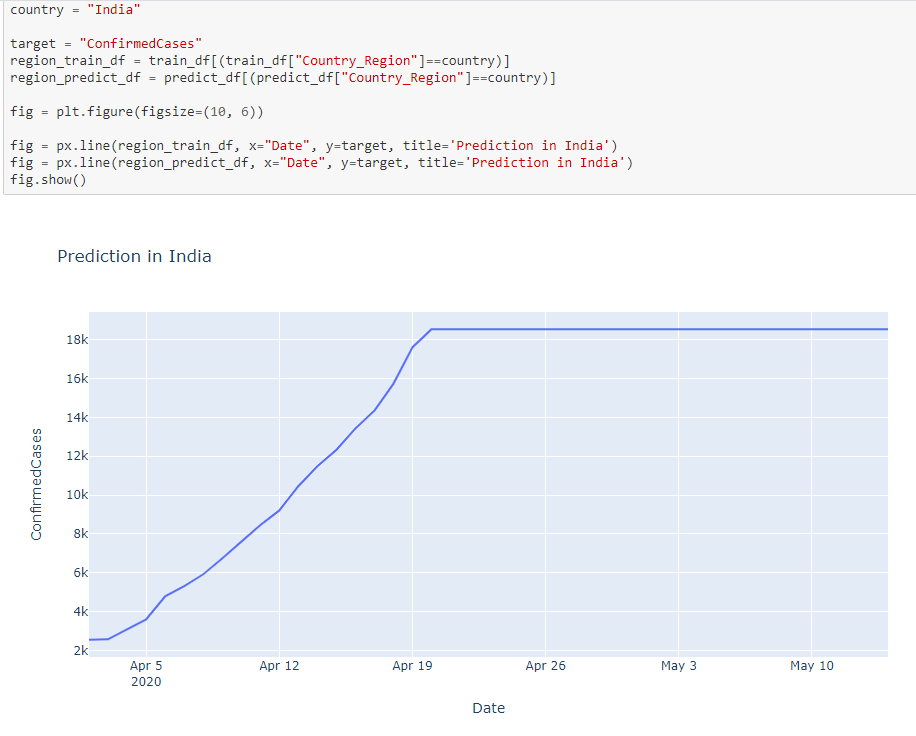

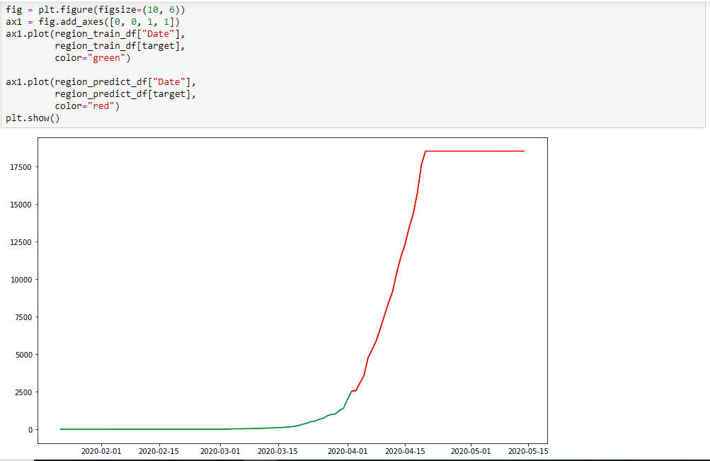

### Clean up model and kfserving
Delete COVID model and kfserving.

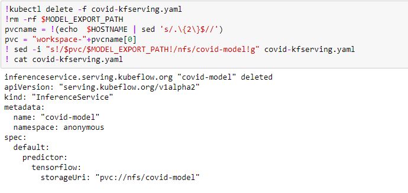
