# BLERSSI Location Prediction using Kubeflow Fairing 

## What we're going to build

Train & Save a BLERSSI location model using Kubeflow fairing from jupyter notebook. Then, deploy the trained model to Kubeflow for Predictions.


## Infrastructure Used

* Cisco UCS - C240


## Setup


### Install NFS server (if not installed)

To install NFS server follow [steps](./../notebook#install-nfs-server-if-not-installed)

### Create Jupyter Notebook Server

Follow the [steps](./../notebook#create--connect-to-jupyter-notebook-server) to create & connect to Jupyter Notebook Server in Kubeflow

### Upload Notebook, Dockerfile and blerssi-model files

Upload [BLERSSI-Classification-fairing.ipynb](BLERSSI-Classification-fairing.ipynb), [Dockerfile](Dockerfile) and [blerssi-model.py](blerssi-model.py) to notebook server.

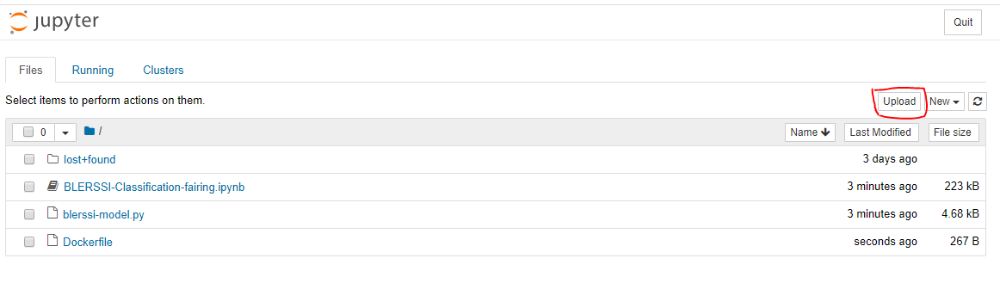

### Run BLERSSI Notebook

Open the BLERSSI-Classification-fairing.ipynb file and run notebook

### Configure Docker credentials

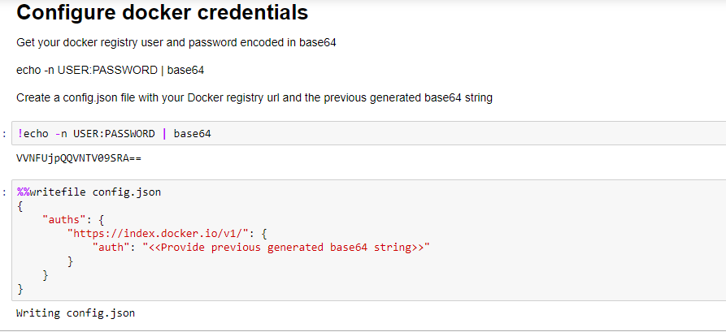

### Create requirements.txt with require python packages

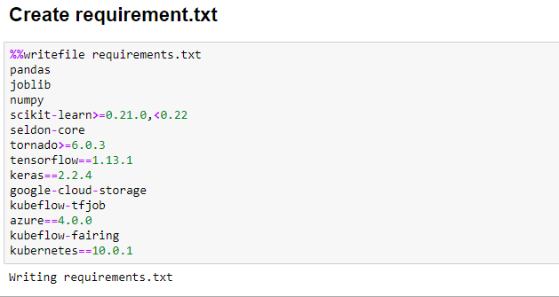

### Import Fairing Packages

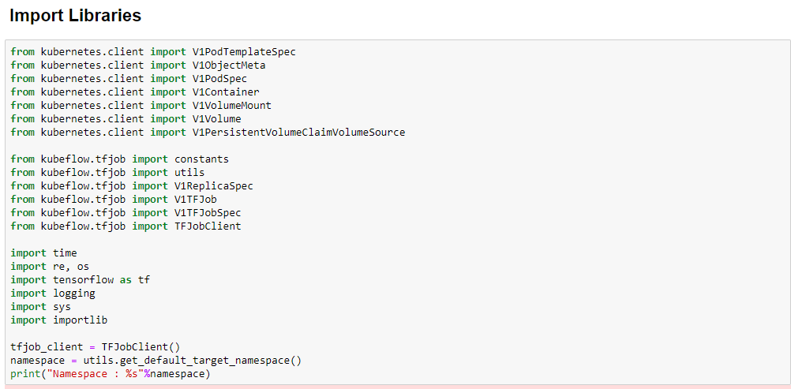

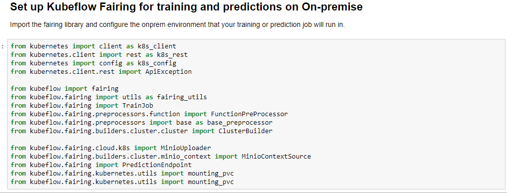

### Get minio-service cluster IP to upload docker build context

Note: Please change DOCKER_REGISTRY to the registry for which you've configured credentials. Built training image are pushed to this registry.

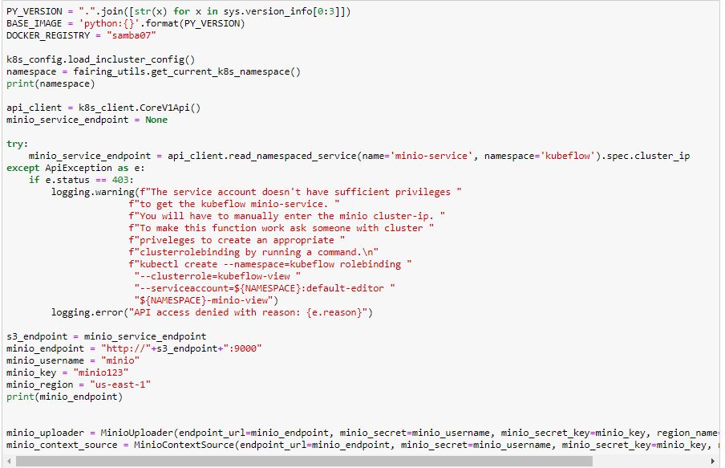

### Create config-map to map your own docker credentials from created config.json

Note: create configmap named "docker-config". If already exists, delete existing one and create new configmap.

* Delete existing configmap

```
kubectl delete configmap -n $namespace docker-config
```

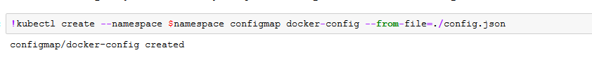

### Build docker image for our model

output_map is a map from source location to the location inside the context.

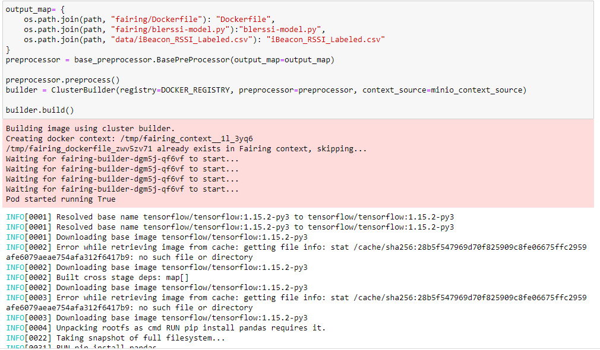

### Define TFJob Class to create training job


### Define Blerssi class to be used by Kubeflow fairing

Note: Must necessarily contain train() and predict() methods


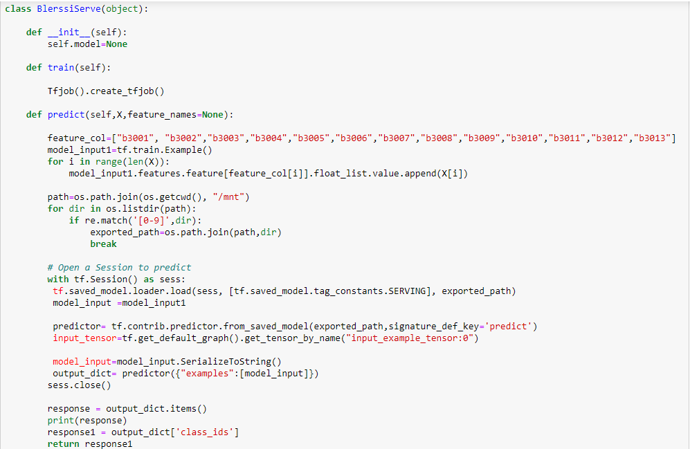


### Train Blerssi model remotely on Kubeflow

Kubeflow Fairing packages the BlerssiServe class, the training data, and prerequisites as a Docker image. 
It the builds & runs the training job on kubeflow.

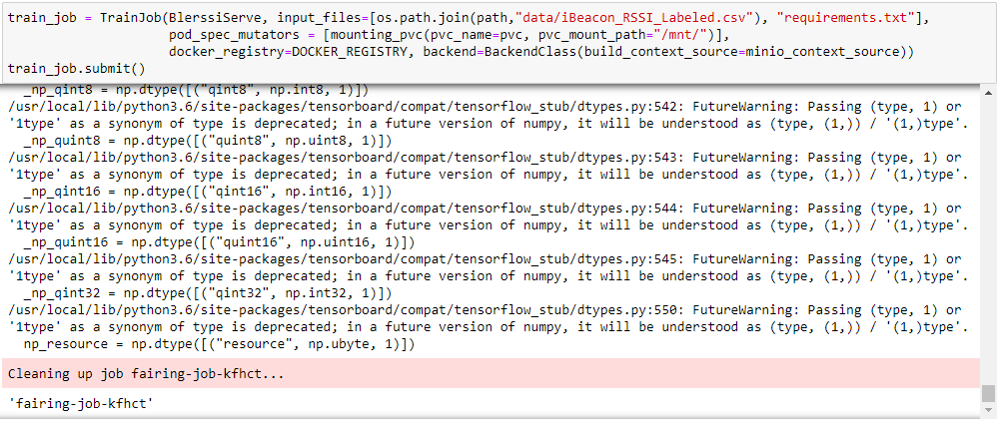

### Deploy the trained model to Kubeflow for predictions


### Get prediction endpoint

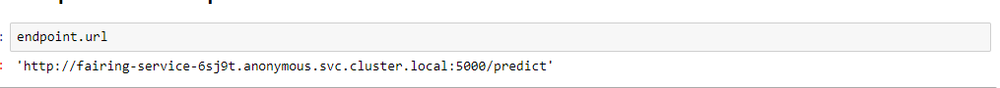

### Predict location for data using prediction endpoint

Change endpoint in the curl command to previous cell output, before executing location prediction.


### Clean up the prediction endpoint
Delete the prediction endpoint created by this notebook.


