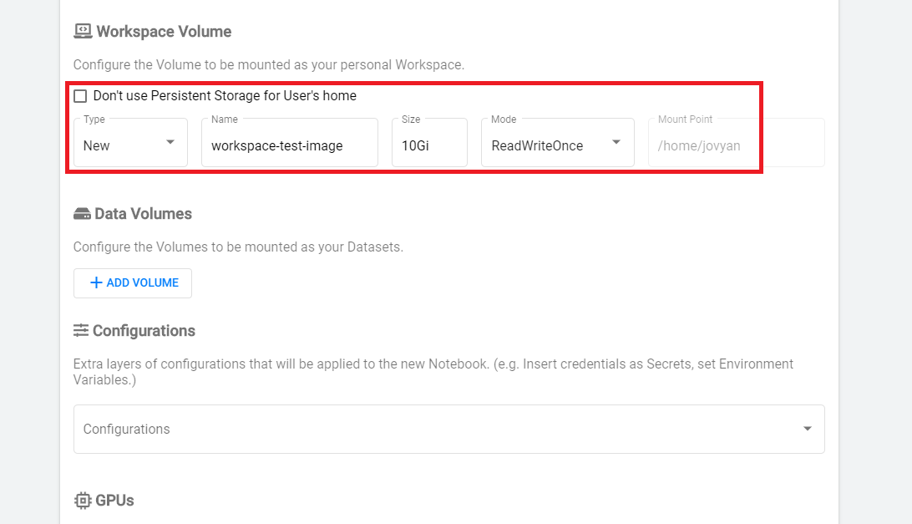
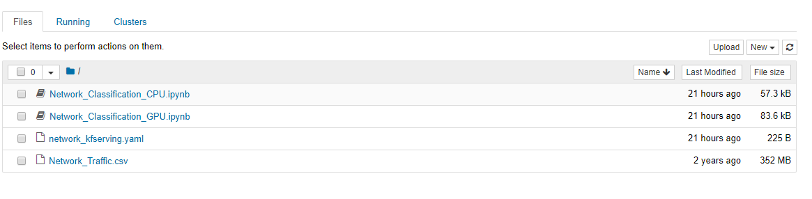
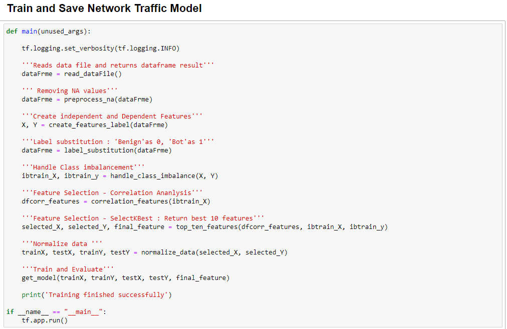
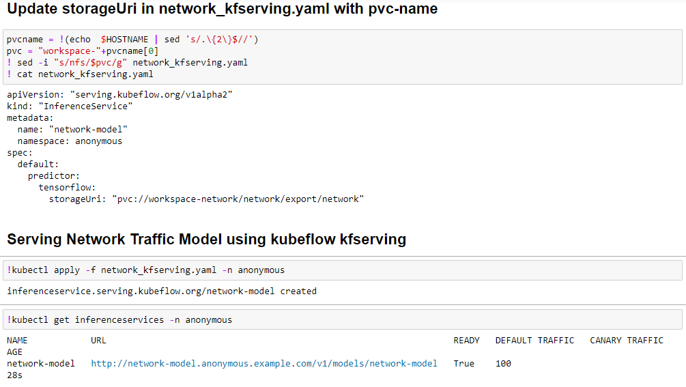
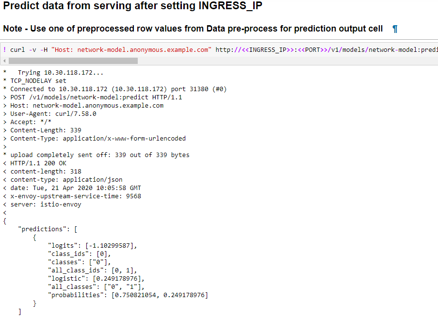

# Network Traffic Location Prediction 

## What we're going to do

Train & save a Network Traffic  model from kubeflow jupyter notebook.
Then, serve and predict using the saved model.

### Infrastructure Used

* Cisco UCS - C240

## Setup

### Install NFS server (if not installed)

To install NFS server follow steps below.

#### Retrieve Ingress IP

For installation, we need to know the external IP of the 'istio-ingressgateway' service. This can be retrieved by the following steps.

```
kubectl get service -n istio-system istio-ingressgateway
```

If your service is of LoadBalancer Type, use the 'EXTERNAL-IP' of this service.

Or else, if your service is of NodePort Type - run the following command:

```
kubectl get nodes -o wide
```

Use either of 'EXTERNAL-IP' or 'INTERNAL-IP' of any of the nodes based on which IP is accessible in your network.

This IP will be referred to as INGRESS_IP from here on.

#### Installing NFS server, PVs and PVCs.

Follow the [steps](../../../ble-localization/onprem/install) to install NFS server, PVs and PVCs.

### Create & Connect to Jupyter Notebook Server

You can access Kubeflow Dashboard using the Ingress IP, provided while running [nfs-installation](../../../ble-localization/onprem/install#-provide-ucs-cluster-ip) script, and _31380_ port. For example, http://<INGRESS_IP:31380>

Select _anonymous_ namespace and click Notebook Servers in the left panel of the Kubeflow Dashboard


Click New Server button and provide required details 


Provide Notebook Server name and select notebook image appropriately as below
     
     CPU  - gcr.io/kubeflow-images-public/tensorflow-1.15.2-notebook-cpu:1.0.0
     GPU  - gcr.io/kubeflow-images-public/tensorflow-1.15.2-notebook-gpu:1.0.0


Create new Workspace Volume



If you are creating GPU attached notebook then choose number of GPUs and GPU Vendor as *NVIDIA*. 

Click Launch Button


Once Notebook Server is created, click on Connect button.


### Upload Notebook, Data & Yaml files

Upload the [Network_Classification_CPU.ipynb](./Network_Classification_CPU.ipynb) or [Network_Classification_GPU.ipynb](./Network_Classification_GPU.ipynb), [network_kfserving.yaml](./network_kfserving.yaml) and dataset to the Notebook Server.

The dataset is available at -

https://cse-cic-ids2018.s3.ca-central-1.amazonaws.com/Processed+Traffic+Data+for+ML+Algorithms/Friday-02-03-2018_TrafficForML_CICFlowMeter.csv



### Train Network Model

Open the notebook file and run first command to train Network Traffic model



Once training completes, the model will be stored in local notebook server


### Serve Network Traffic Model from K8s PVC through Kfserving



### Predict location for test data using served Network Traffic Model 

Change Ingress IP in the curl command to your provided value before executing location prediction.




Prediction - class(0) is the predicted response using kubeflow-kfserving which represents the target label as "Benign"

