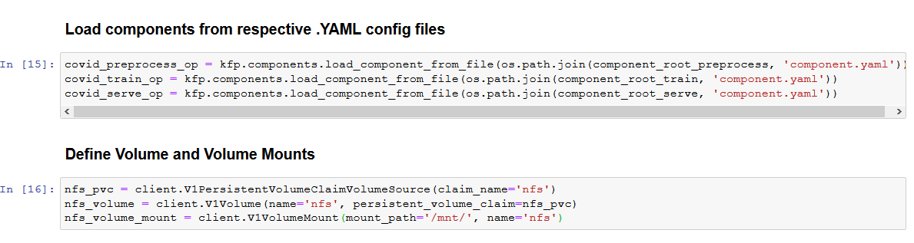
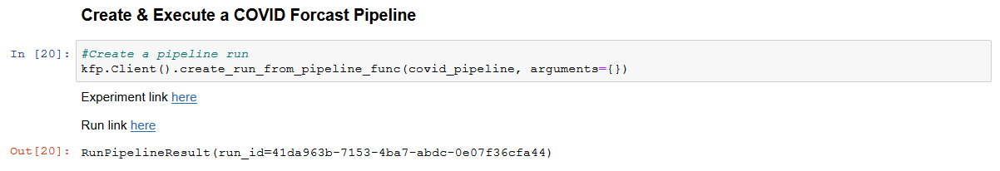
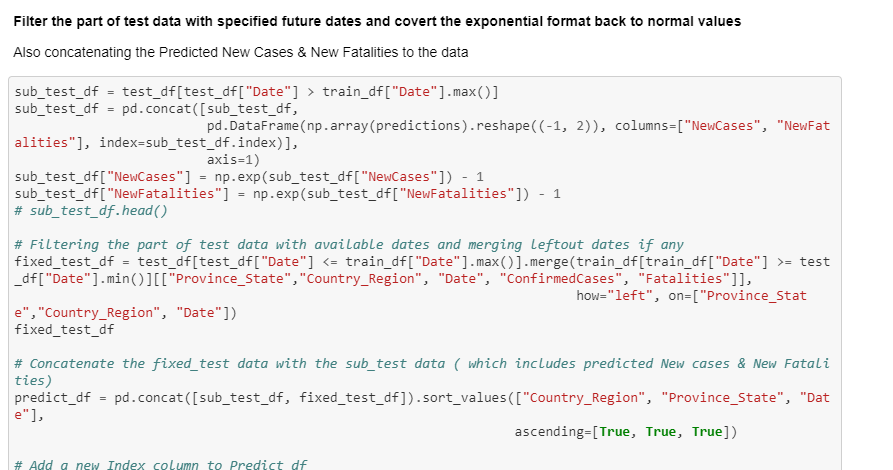

# COVID-19 Forecasting using Kubeflow Pipelines

## What we're going to build

To train, serve a COVID model using Kubeflow Pipeline and get prediction for client request through Jupyter notebook.

## Infrastructure Used

* Cisco UCS - C240M5 and C480ML

### Upload Notebook file

Upload [COVID-Pipeline-Deployment.ipynb](https://github.com/CiscoAI/cisco-kubeflow-starter-pack/blob/master/apps/healthcare/covid-forecasting/onprem/pipelines/COVID_Pipeline_Deployment.ipynb)

### Run COVID Pipeline

Open the COVID-Pipeline-Deployment.ipynb file and run pipeline

Clone git repo

Load The Components

Define the COVID Pipeline Function

Once COVID Pipeline is executed, Experiment and Run link will be generated and displayed as output

Click on latest experiment which is created 

Pipeline components execution can be viewed as below.

Logs of COVID Preprocessing Component

Logs of COVID Training Component

Logs of COVID TF Serving Component

Once pipeline execution is completed return to notebook and execute next cell

Pre-process prediction dataset

Make a REST API invocation to serving endpoint for prediction

Post-processing on the prediction

Forecast Table with confirmed Cases

Plot predicted cases in upcoming days

