# Malicious Network Traffic Predicton using Pipelines

## What we're going to build

Train and serve Network Traffic model using KF pipeline, and predict flow label for client's data from Jupyter notebook.

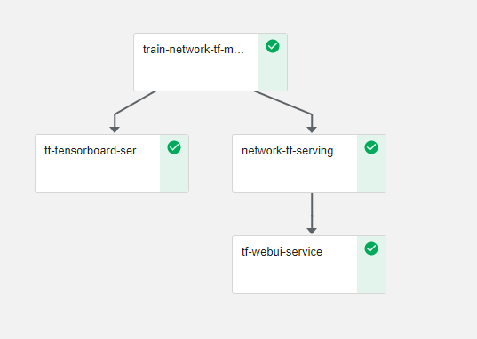

## Infrastructure Used

* Cisco UCS - C240M5 and C480ML

## Setup

### Upload Notebook file

Upload [Network Traffic-Pipeline-Deployment.ipynb](https://github.com/CiscoAI/cisco-kubeflow-starter-pack/blob/master/apps/networking/network-traffic/onprem/pipelines/Network-Pipeline-Deployment.ipynb)

### Run Network Traffic Pipeline

Open the Network Traffic-Pipeline-Deployment.ipynb file and run pipeline

Clone git repo

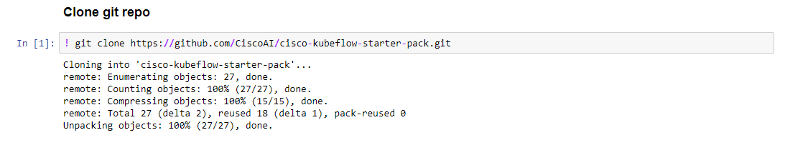

Loading Components

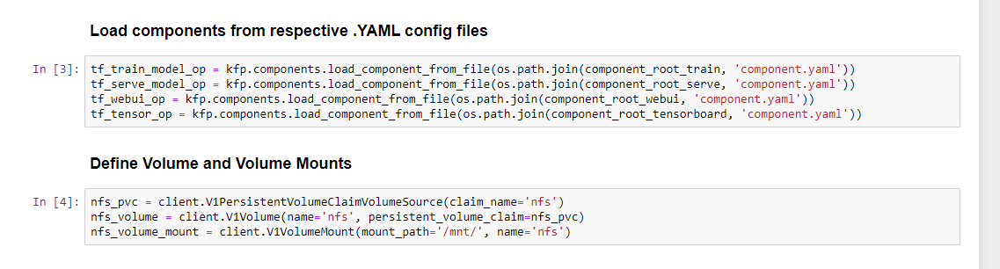

Run Pipeline

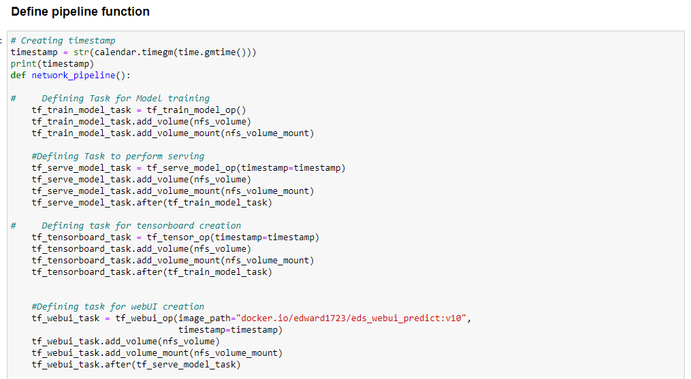

Once Network Traffic Pipeline is executed Experiment and Run link will generate and displayed as output

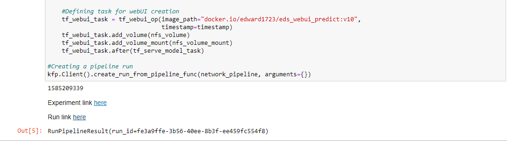

Click on latest experiment which is created

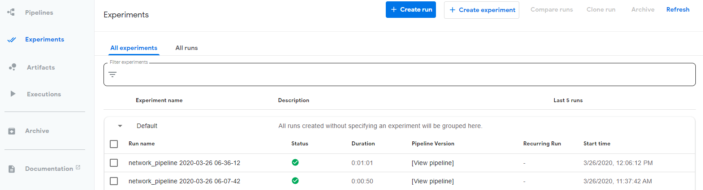

Pipeline components execution can be viewed as below

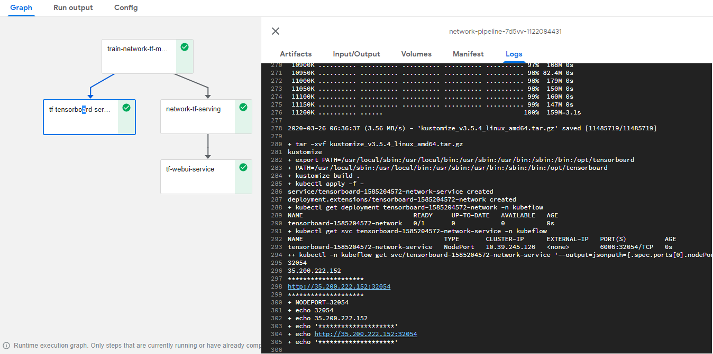

Logs of Network Traffic Training Component

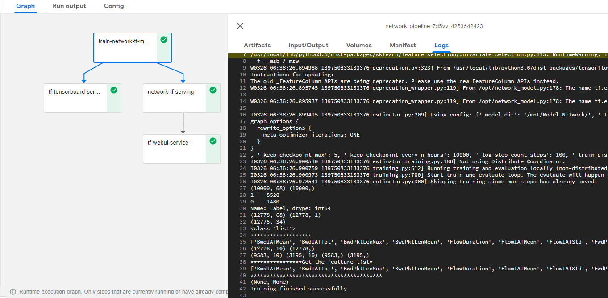

Logs of Serving Component

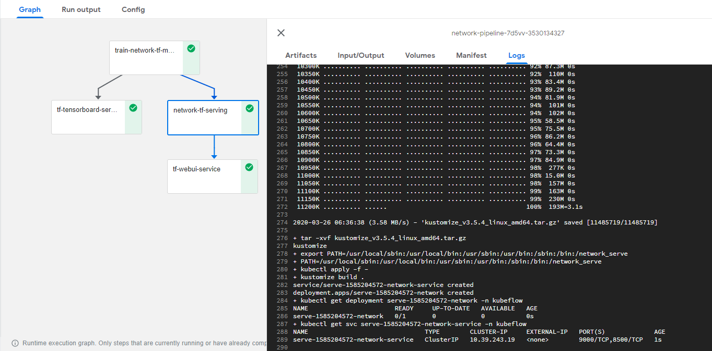

Logs of WebUI Component

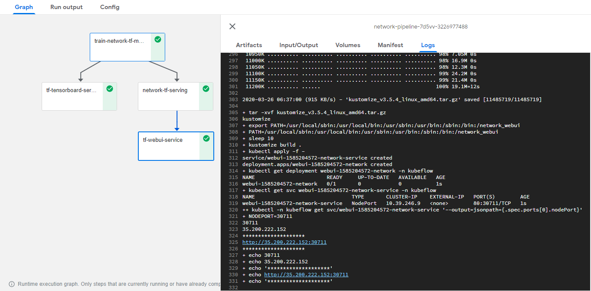

Tensorboard Graph for Network Traffic

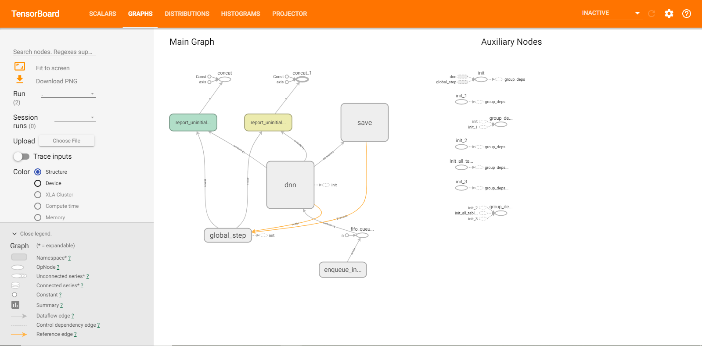

 Using Web UI - upload test data file located [here](https://github.com/CiscoAI/cisco-kubeflow-starter-pack/blob/master/apps/networking/network-traffic/onprem/data/Network_Test_Traffic.csv)

 Prediction of Traffic flow label and its probability

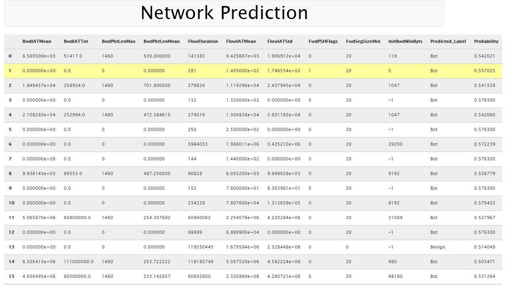
