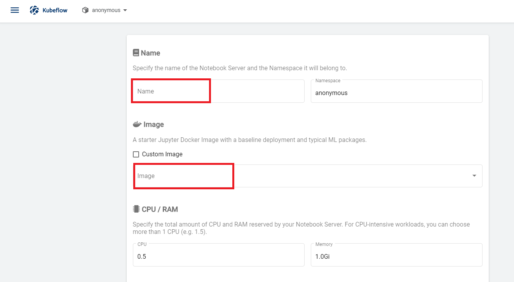

# Create Jupyter Notebook Server

## Retrieve Ingress IP

For installation, we need to know the external IP of the 'istio-ingressgateway' service. This can be retrieved by the following steps.

```
kubectl get service -n istio-system istio-ingressgateway
```

If your service is of LoadBalancer Type, use the 'EXTERNAL-IP' of this service.

Or else, if your service is of NodePort Type - run the following command:

```
kubectl get nodes -o wide
```

Use either of 'EXTERNAL-IP' or 'INTERNAL-IP' of any of the nodes based on which IP is accessible in your network.

This IP will be referred to as INGRESS_IP from here on.

### Create & Connect to Jupyter Notebook Server

You can access Kubeflow Dashboard using the INGRESS_IP at _31380_ port. <br>
For example, http://INGRESS_IP:31380

Select _anonymous_ namespace and click Notebook Servers in the left panel of the <br>
Kubeflow Dashboard


Click New Server button and provide required details 


Provide Notebook Server name and use prebuilt image `samba07/pipeline-notebook:v0.1` in the Image Tab.



Set Workspace Volume type as _None_.


Click Add Volume under Data Volume; Set type to _existing_ and name to _nfs1_ with mount point as /mnt/


Click LAUNCH Button


Once the Notebook Server is created, click on connect button.


